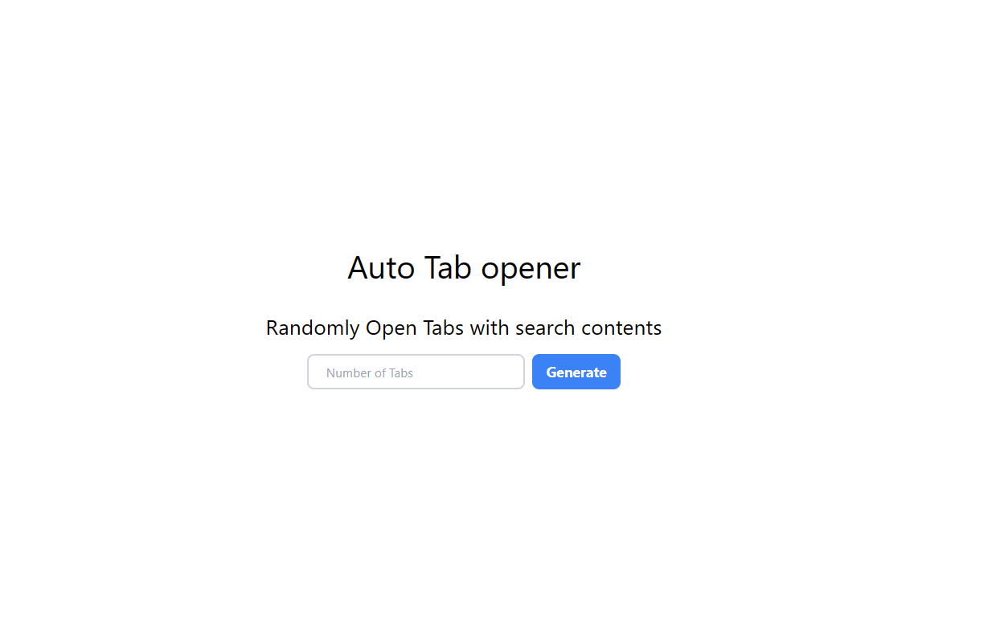
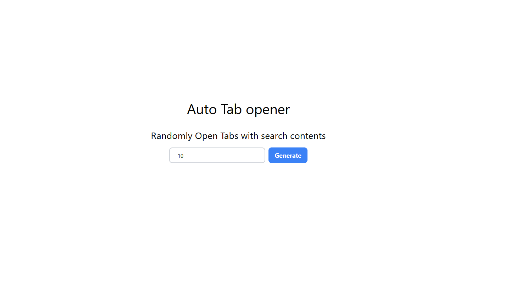
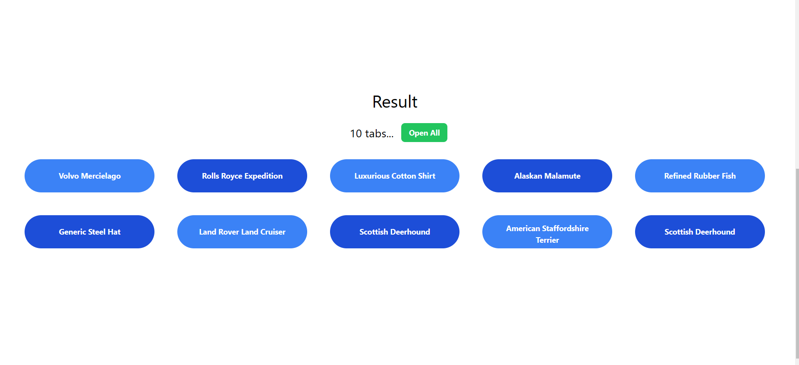

<div align="center">
    <h1>Random Tab Opener</h1>
    <p>Random Tab Opener is funny little project that opens random tabs for you</p>
    <p>Made with <a href="https://nextjs.org/">Next.js</a>
     and <a href="https://tailwindcss.com/">Tailwind CSS</a></p>
</div>




_Tired of opening the tabs every day just to pass the number of tabs you want to open?_ This project is for you. It will open the tabs for you.

## Usage

To use this project, you can run it locally

```
$ git clone
$ cd random-tab-opener
$ pnpm install
$ pnpm run dev
```

## Screenshots





## License

Random Tab Opener is licensed under the MIT License.

**Free Software, Hell Yeah!**
